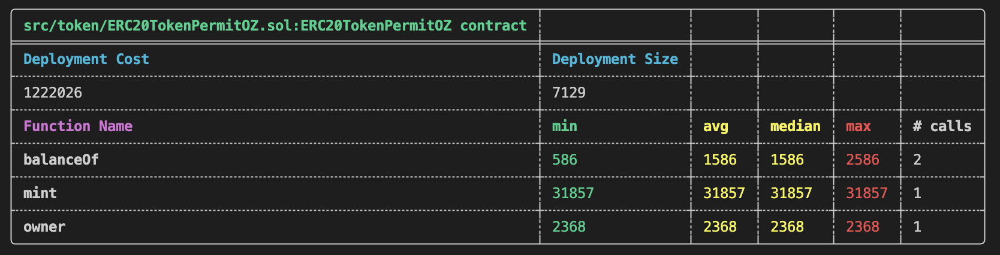
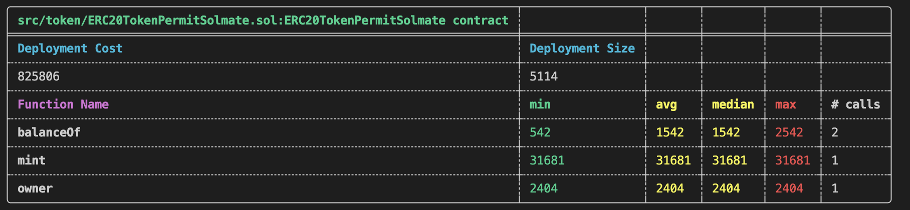

## Three ERC20 tokens and gas cost


### Tool

foundry


### Source && Report

#### ERC20Token.sol

```solidity
// SPDX-License-Identifier: MIT
pragma solidity ^0.8.0;

import "@openzeppelin/contracts/token/ERC20/ERC20.sol";
import "@openzeppelin/contracts/access/Ownable.sol";

contract ERC20Token is ERC20, Ownable {
    constructor(string memory name, string memory symbol, uint256 totalSupply) ERC20(name, symbol) {
        _mint(msg.sender, totalSupply);
    }

    function mint(address to, uint256 amount) external onlyOwner {
        _mint(to, amount);
    }

    function burn(uint256 amount) external {
        _burn(msg.sender, amount);
    }
}

```

gas report:


#### ERC20TokenPermitOZ.sol

```solidity
// SPDX-License-Identifier: UNLICENSED

pragma solidity ^0.8.0;

import "@openzeppelin/contracts/token/ERC20/extensions/draft-IERC20Permit.sol";
import "@openzeppelin/contracts/token/ERC20/ERC20.sol";
import "@openzeppelin/contracts/access/Ownable.sol";
import "@openzeppelin/contracts/utils/cryptography/draft-EIP712.sol";
import "@openzeppelin/contracts/utils/cryptography/ECDSA.sol";
import "@openzeppelin/contracts/utils/Counters.sol";

/// @notice ERC20 + EIP2615 + EIP712
/// @author Dreamix (https://github.com/Dreamix-Labs/Dreamix_Contract/tree/main/src/token/ERC20.sol)
/// @author Modified from OpenZeppelin
contract ERC20TokenPermitOZ is IERC20Permit, ERC20, EIP712, Ownable {
    using Counters for Counters.Counter;

    mapping(address => Counters.Counter) private _nonces;

    // solhint-disable-next-line var-name-mixedcase
    bytes32 private constant _PERMIT_TYPEHASH =
        keccak256("Permit(address owner,address spender,uint256 value,uint256 nonce,uint256 deadline)");
    /**
     * @dev In previous versions `_PERMIT_TYPEHASH` was declared as `immutable`.
     * However, to ensure consistency with the upgradeable transpiler, we will continue
     * to reserve a slot.
     * @custom:oz-renamed-from _PERMIT_TYPEHASH
     */
    // solhint-disable-next-line var-name-mixedcase
    bytes32 private _PERMIT_TYPEHASH_DEPRECATED_SLOT;

    /**
     * @dev Initializes the {EIP712} domain separator using the `name` parameter, and setting `version` to `"1"`.
     *
     * It's a good idea to use the same `name` that is defined as the ERC20 token name.
     */
    constructor(string memory name, string memory symbol, uint256 totalsupply) ERC20(name, symbol) EIP712(name, "1") {
        _mint(msg.sender, totalsupply);
    }

    function mint(address to, uint256 amount) external onlyOwner {
        _mint(to, amount);
    }

    function burn(uint256 amount) external {
        _burn(msg.sender, amount);
    }

    /**
     * @dev See {IERC20Permit-permit}.
     */
    function permit(
        address owner,
        address spender,
        uint256 value,
        uint256 deadline,
        uint8 v,
        bytes32 r,
        bytes32 s
    ) public virtual override {
        require(block.timestamp <= deadline, "ERC20Permit: expired deadline");

        bytes32 structHash = keccak256(abi.encode(_PERMIT_TYPEHASH, owner, spender, value, _useNonce(owner), deadline));

        bytes32 hash = _hashTypedDataV4(structHash);

        address signer = ECDSA.recover(hash, v, r, s);
        require(signer == owner, "ERC20Permit: invalid signature");

        _approve(owner, spender, value);
    }

    /**
     * @dev See {IERC20Permit-nonces}.
     */
    function nonces(address owner) public view virtual override returns (uint256) {
        return _nonces[owner].current();
    }

    /**
     * @dev See {IERC20Permit-DOMAIN_SEPARATOR}.
     */
    // solhint-disable-next-line func-name-mixedcase
    function DOMAIN_SEPARATOR() external view override returns (bytes32) {
        return _domainSeparatorV4();
    }

    /**
     * @dev "Consume a nonce": return the current value and increment.
     *
     * _Available since v4.1._
     */
    function _useNonce(address owner) internal virtual returns (uint256 current) {
        Counters.Counter storage nonce = _nonces[owner];
        current = nonce.current();
        nonce.increment();
    }
}

```

gas report:




#### ERC20TokenPermitSolmate.sol

```solidity
// SPDX-License-Identifier: UNLICENSED

pragma solidity ^0.8.0;

import "solmate/tokens/ERC20.sol";
import "solmate/auth/Owned.sol";

contract ERC20TokenPermitSolmate is ERC20, Owned {
    constructor(string memory name, string memory symbol, uint256 totalsupply) ERC20(name, symbol, 18) Owned(msg.sender) {
        _mint(msg.sender, totalsupply);
    }

    function mint(address to, uint256 amount) external onlyOwner {
        _mint(to, amount);
    }

    function burn(uint256 amount) external {
        _burn(msg.sender, amount);
    }
}
```

gas report:



