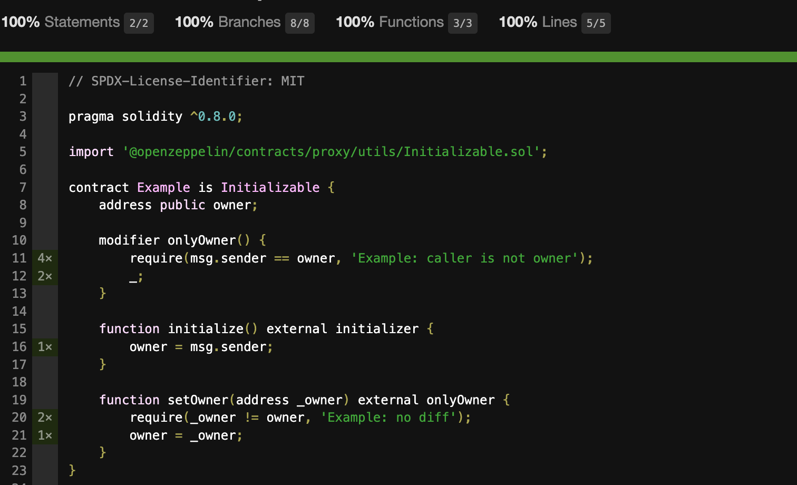

# Hardhat

Solidity dev framework - HardHat. My favorite project😆.

```sh
888    888                      888 888               888
888    888                      888 888               888
888    888                      888 888               888
8888888888  8888b.  888d888 .d88888 88888b.   8888b.  888888
888    888     "88b 888P"  d88" 888 888 "88b     "88b 888
888    888 .d888888 888    888  888 888  888 .d888888 888
888    888 888  888 888    Y88b 888 888  888 888  888 Y88b.
888    888 "Y888888 888     "Y88888 888  888 "Y888888  "Y888
```


## Plugins


### Solidity-coverage

覆盖率测试插件，测试结果维度：

- 语句覆盖率（Statement Coverage）：代码中每一个语句是否都被执行过至少一次的比例。

- 分支覆盖率（Branch Coverage）：代码中每一个分支逻辑是否都被测试过至少一次的比例。
- 函数覆盖率（Function Coverage）：代码中每一个函数是否都被调用过至少一次的比例。
- 行覆盖率（Line Coverage）：代码中每一行是否都被执行过至少一次的比例。


#### Example Code

```solidity
// SPDX-License-Identifier: MIT
 
pragma solidity ^0.8.0;
 
import '@openzeppelin/contracts/proxy/utils/Initializable.sol';
 
contract Example is Initializable {
    address public owner;
 
    modifier onlyOwner() {
        require(msg.sender == owner, 'Example: caller is not owner');
        _;
    }
 
    function initialize() external Einitializer {
        owner = msg.sender;
    }
 
    function setOwner(address _owner) external onlyOwner {
        require(_owner != owner, 'Example: no diff');
        owner = _owner;
    }
}
```

```typescript
// ....    
    describe('#initialize', async () => {
        it('fail for init again', async () => {
            await expect(e.initialize()).to.reverted
        })
    })

    describe('#setOwner', async () => {
        it('success', async () => {
            await e.setOwner(other.address)
            expect(await e.owner()).to.eq(other.address)
        })

        it('fail for not owner', async () => {
            await expect(e.connect(other).setOwner(other.address)).to.reverted
        })

        it("fail for same param", async () => {
            await expect(e.setOwner(wallet.address)).to.reverted
        })
    })
// ....
```


#### Analyse




##### 100% Statements 2/2 

TODO


##### 100% Branches 8/8

`initialize()` 

- It is first time to call.
- it is not the first to call.

`setOwner()`

- Caller is not owner.
- Caller is owner and Param `_owner` is same with old.
- Caller is  owner and param _owner is different from old.


##### 100% Functions 3/3

TODO


##### 100% Lines 5/5

TODO